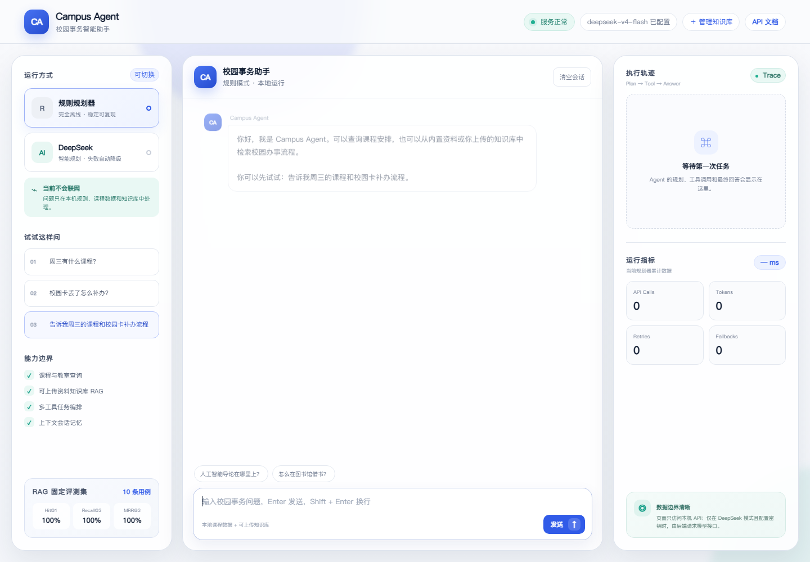

# Campus Agent

一个面向高校学生的校园事务智能助手，也是用于学习和展示企业级 Agent 工程链路的完整项目。它把课程查询、校园办事知识和实时业务状态统一到一个网页工作台，由 LangGraph 负责任务规划、工具路由、Agentic RAG、答案验证和会话提交。

项目默认使用本地 Rule、Hashing Embedding 和明确标记的 Mock 业务数据，不联网。可选接入 DeepSeek、真实中文 BGE Embedding、LangSmith Trace，以及获得授权的校园只读业务 API；所有网络能力均需显式配置。项目不使用 Dify，也不会搜索或抓取普通网页。



| 维度 | 当前实现 |
|---|---|
| 工作流 | LangGraph StateGraph，Plan → Tool → Grade/Rewrite → Compose → Verify → Commit |
| 检索 | BM25 + BGE Vector + Weighted RRF，metadata 过滤与结构化 Citation |
| 模型 | 本地 Rule 默认运行；DeepSeek Planner/Composer 可选且失败安全回退 |
| 服务 | FastAPI + 原生 Web + POST SSE Trace + SQLite Checkpoint |
| 业务集成 | Mock/Official 可替换只读校园 API，TTL/Stale/Singleflight 缓存 |
| 质量保障 | 179 项自动化测试、28 个 subtests、100 条版本化离线评测用例 |

## 当前能力

- Rule 与 DeepSeek 两种 Planner 使用同构的 LangGraph runtime，共享知识库、SQLite Saver 和会话 thread。
- `query_courses`、`search_campus_knowledge`、`query_campus_service_status` 三个白名单工具，支持单次多工具任务。
- Markdown/TXT/PDF 本地摄取、持久化、删除和原子重建索引。
- BM25 + 本地向量 + RRF 的 Hybrid Retrieval；支持真实中文 BGE、模型版本锁定、增量向量缓存，索引期或查询期故障自动降级 BM25。
- Chunk metadata 与 `domain/category/version/origin/document_id` 服务端过滤；上传 API 可登记 domain、category 和 version。
- Grade → Rewrite → Retrieve 的有界循环，最多检索两轮，不会无限重试。
- 对引用归属以及回答中新出现的编号、时间、金额进行 Verify；失败时回退到工具证据。
- 返回结构化 Citation，网页以来源卡片展示，不暴露磁盘路径。
- FastAPI + 原生 HTML/CSS/JavaScript 工作台，使用 POST SSE 实时显示 Graph Trace。
- Web 会话由受限保留的 LangGraph SQLite Checkpoint 持久化，服务重启后仍可追问；异常/断流回合回滚，CLI 使用轻量内存会话。
- DeepSeek 缺少 Key、网络失败、输出不符合 Schema 时安全回退规则 Planner。
- 只读业务 API 提供 Mock/Official 两个 Gateway；Official 只允许固定 HTTPS GET、服务端 Bearer Token、响应 Schema 校验、超时/有限重试和 TTL/Stale 缓存，失败不会伪装成 Mock 成功。
- 100 条版本化 JSONL 评测集覆盖正例、完全无关问题、缺失精确事实、metadata 过滤和 Agentic 行为，并输出 JSON/JSONL/Markdown 报告。

## 完整架构

```text
Browser
  └─ POST /api/chat/stream（fetch + SSE）
       │
       ▼
FastAPI / WebAgentService
  ├─ session 串行锁
  ├─ Rule / DeepSeek 模式选择
  └─ CSRF、Origin、输入边界与安全响应头
       │
       ▼
CampusAgent（兼容入口）
       │
       ▼
LangGraph StateGraph
  START → plan
             ├─ direct answer ─────────────────────────────┐
             └─ execute tools                              │
                    ├─ 只有课程工具 → compose → verify ───┤
                    └─ 知识检索 → grade                    │
                                   ├─ relevant → compose ──┤
                                   └─ insufficient          │
                                         → rewrite          │
                                         → retrieve（最多1次）
                                         → grade → compose  │
                                                       verify
                                                          │
                                                     commit turn
                                                          │
                                                         END

ToolRegistry
  ├─ query_courses
  ├─ search_campus_knowledge
  │    └─ LocalRAG immutable snapshot
  │         ├─ BM25Retriever
  │         ├─ VectorRetriever → BGE/Hashing → NPZ增量缓存
  │         └─ HybridRetriever（Weighted RRF）
  │              ▲
  │              └─ KnowledgeBaseService
  │                   ├─ 内置 Markdown
  │                   └─ 用户上传 Markdown / TXT / PDF
  └─ query_campus_service_status（只读）
       └─ TTL/Stale/Singleflight Cache
            ├─ Mock Gateway（默认，输出带[模拟数据]）
            └─ Official HTTPS Gateway（需学校授权）

LangGraph Checkpointer
  └─ SQLite：按 thread_id 保存最近 20 条消息的唯一最新快照

Offline Evaluation
  └─ 100条固定JSONL → BM25 / Vector / Hybrid → JSONL + Markdown报告
```

更适合阅读和面试讲解的图形版本：[`Campus-Agent流程图.pdf`](docs/Campus-Agent流程图.pdf)；可编辑源文件：[`campus-agent-flow-diagrams.html`](docs/campus-agent-flow-diagrams.html)。

所有生产入口都经过相同的 LangGraph 拓扑。Rule 与 DeepSeek 是两个同构的编译 runtime，不是假装成同一个实例；它们共享 Saver/thread 与同一个知识索引。`campus_agent/agent.py` 只是稳定兼容层，实际图定义位于 `campus_agent/graph/`。

### LangChain 在哪里

主生产链使用的是 LangGraph + 项目自己的 Planner/ToolRegistry。`campus_agent/langchain_agent.py` 另外提供 LangChain v1 `create_agent` 与 `@tool` 的可重复演示，用来展示标准模型—工具循环；它不是网页主链路。这样可以准确说明“会 LangChain，也真正把 LangGraph 用在生产编排上”，不会把旁路 Demo 冒充主架构。

### Dify 在哪里

本项目没有接入 Dify。Dify 是可视化工作流平台，而这个项目直接在 Python 中实现相同类别的关键能力：状态图、条件路由、工具节点、RAG、Checkpoint、Trace 和评测。因此可以完整解释每一层，而不是只会拖拽节点。

## 安装与运行

```powershell
cd C:\Users\yixing\Desktop\work\agent-learning\campus-agent
python -m venv .venv
.\.venv\Scripts\Activate.ps1
python -m pip install -e ".[dev]"
```

命令行离线运行：

```powershell
python -m campus_agent --trace
```

网页运行：

```powershell
python -m campus_agent.web
```

浏览器访问：

```text
http://127.0.0.1:8000
```

### Windows 一键启动

安装好虚拟环境并准备好 BGE 模型后，可以直接双击项目根目录的：

```text
start-campus-agent.cmd
```

启动器会使用 `.venv` 中的 Python，设置本地 BGE、local-only 和 Mock 业务 API，等待健康检查通过后自动打开 `http://127.0.0.1:8000`。它不会保存或主动设置 DeepSeek Key，但会继承启动终端已有的环境变量；需要 DeepSeek 时，应在同一个终端预先设置 `DEEPSEEK_API_KEY`。

同一可信局域网内临时演示：

```powershell
.\start-campus-agent.cmd lan
ipconfig
```

让对方连接同一 Wi-Fi，并访问 `http://你的IPv4地址:8000`。Windows 防火墙询问时只允许“专用网络”。默认本机模式监听 `127.0.0.1`；`lan` 模式才监听 `0.0.0.0`。

启动器会把检测到的本机 IPv4 加入 `CAMPUS_WEB_ALLOWED_HOSTS`。手动使用反向代理或正式域名时，必须显式登记浏览器实际访问的 Host，例如：

```powershell
$env:CAMPUS_WEB_ALLOWED_HOSTS="127.0.0.1,localhost,campus.example.com"
.\start-campus-agent.cmd
```

只填写域名或 IPv4，不要包含 `https://`、端口或路径；为了防止 Host Header 攻击，配置不接受全局通配符 `*`。

当前知识库上传、删除、重建接口没有用户登录鉴权，因此不要把 `lan` 模式直接映射到公网。GitHub Pages 只能托管静态文件，不能运行本项目的 Python/FastAPI 后端。正式分享应把应用部署到支持 Python 的服务器或容器，并至少补充登录鉴权、HTTPS、请求限流、持久卷和服务端 Secret 管理；临时外网演示可使用带身份访问策略的正式 Cloudflare Tunnel，将服务地址指向 `http://localhost:8000`，同时把公网域名加入 `CAMPUS_WEB_ALLOWED_HOSTS`。Cloudflare Quick Tunnel 不支持 SSE，不适合当前网页的流式聊天接口。

可以尝试：

```text
周三有什么课程？
人工智能导论在哪里上？
校园卡丢了怎么补办？
一卡通不见了怎么重办？
告诉我周一的课程和校园卡补办流程。
```

## DeepSeek 配置

在启动服务的同一个 PowerShell 窗口设置：

```powershell
$env:DEEPSEEK_API_KEY="你的密钥"
$env:DEEPSEEK_MODEL="deepseek-v4-flash"
$env:DEEPSEEK_TIMEOUT_SECONDS="30"
$env:DEEPSEEK_MAX_RETRIES="1"
python -m campus_agent.web
```

没有设置 `DEEPSEEK_API_KEY` 时，选择 DeepSeek 也不会发起网络请求，而是本地回退 Rule Planner。Key 只存在于 Python 后端模型客户端，不进入 Graph State、SQLite、HTML、JavaScript、浏览器存储或 API 响应。

## LangSmith 调试（可选）

当前生产主链是真实的 LangGraph `StateGraph`，因此可以直接打开基础 LangSmith Trace，查看节点顺序、分支、输入输出、耗时和异常：

```powershell
$env:LANGSMITH_TRACING="true"
$env:LANGSMITH_API_KEY="你的LangSmith API Key"
$env:LANGSMITH_PROJECT="campus-agent-dev"
.\start-campus-agent.cmd
```

随后在 LangSmith 的 `campus-agent-dev` Project 中查看 `plan`、`execute_tools`、`grade_documents`、`rewrite_query`、`compose`、`verify_answer` 和 `commit_turn` 等节点。当前 DeepSeek 客户端、ToolRegistry 和 Hybrid Retriever 是自定义 Python 实现，尚未使用 `@traceable` 拆成独立的 LLM/Tool/Retriever 子 Span，因此准确表述是“支持 LangGraph 基础追踪”，不是“已经完成全链路细粒度可观测性”。

Trace 可能包含用户问题、节点状态、工具结果和命中的知识片段，不要在开启追踪时提交个人隐私或未获授权的校内资料。关闭当前 PowerShell 或移除上述三个环境变量即可停用上报。

## 向量检索配置

默认 `HashingEmbeddingProvider` 是零下载、确定性、纯本地的向量基线。它证明了向量索引和 Hybrid/RRF 架构，但不应宣传为训练型语义模型。

真实语义检索使用 `BAAI/bge-small-zh-v1.5`（512 维），仓库锁定模型 revision。首次准备模型是唯一允许下载的步骤：

```powershell
python -m pip install -e ".[dev,semantic]"
python -m scripts.prepare_embedding_model --allow-download --model-cache-dir .campus_agent_data\models
```

下载完成后，运行期只读本地缓存：

```powershell
$env:CAMPUS_EMBEDDING_PROVIDER="sentence-transformers"
$env:CAMPUS_EMBEDDING_MODEL_CACHE_DIR=".campus_agent_data\models"
$env:CAMPUS_EMBEDDING_LOCAL_ONLY="true"
$env:CAMPUS_EMBEDDING_MINIMUM_SIMILARITY="0.48"
$env:CAMPUS_EMBEDDING_QUERY_PROMPT="为这个句子生成表示以用于检索相关文章："
python -m campus_agent.web
```

阈值 `0.48` 是 dev split 的最佳观测值，冻结 test split 没有参与选择。dev 上的 Hybrid No-hit 为 75%，未达到脚本预设的 90% 生产安全门槛，因此当前仍是求职演示/实验基线，不应宣称生产就绪。需要重新校准时运行：

```powershell
python -m scripts.calibrate_embedding --thresholds 0.44 0.46 0.48 0.50 0.52 0.55 0.60 --output eval\calibration\bge-small-zh-v1.5-dev.json
python -m scripts.evaluate_rag --split test --output-dir eval\reports\bge-small-zh-v1.5-test --baseline eval\baselines\bge-small-zh-v1.5-test.json
```

`CAMPUS_EMBEDDING_LOCAL_ONLY=false` 会被运行期拒绝，避免 Web 启动时隐式联网。模型名、revision、归一化方式和 Query Prompt 都进入缓存指纹；文档不变时直接复用向量，损坏缓存会原子重建。

## 只读校园业务 API

默认是本地 Mock，用于演示 Agent 如何把“补办流程”和“服务中心现在是否开放”拆给 RAG 与实时工具：

```powershell
$env:CAMPUS_BUSINESS_API_MODE="mock"
python -m campus_agent.web
```

可以尝试：

```text
主校区校园卡服务中心现在开门吗？
校园卡丢了怎么办，服务中心现在开门吗？
```

回答中的 `[模拟数据]` 是强制标签。拿到学校正式授权、接口地址和只读 Token 后才启用 Official：

```powershell
$env:CAMPUS_BUSINESS_API_MODE="official"
$env:CAMPUS_BUSINESS_API_BASE_URL="https://学校授权的固定API域名"
$env:CAMPUS_BUSINESS_API_ALLOWED_HOSTS="学校授权的固定API域名"
$env:CAMPUS_BUSINESS_API_TOKEN="只读服务端令牌"
$env:CAMPUS_BUSINESS_API_CACHE_TTL="30"
$env:CAMPUS_BUSINESS_API_CACHE_STALE="300"
python -m campus_agent.web
```

Official 适配器固定请求 `GET {base_url}/v1/campus/service-status`，只接受 `campus_card/registrar/library/student_affairs` 与 `main/east/west` 枚举。Token 只存在于 Python 后端，不进入浏览器、Graph State、SQLite、健康检查或日志。上游失败时只返回显式错误或带标签的旧缓存，绝不会回退到 Mock 冒充实时数据。当前仓库没有学校凭据，因此只能证明适配器、契约与安全边界可运行，不能宣称已接通校内生产系统。

## 本地数据位置

默认存放在启动目录：

```text
.campus_agent_data/knowledge/
├─ <document_id>/                 # 上传资料与 metadata
└─ .agent-checkpoints.sqlite3     # LangGraph 会话 checkpoint
```

自定义知识目录：

```powershell
$env:CAMPUS_KNOWLEDGE_DIR="C:\path\to\campus-knowledge"
```

SQLite 只跟踪 `history`；问题、计划、Trace、工具结果、Citation 和命中文档使用 LangGraph `UntrackedValue`，不会进入 checkpoint。Graph 使用 `durability="exit"`，并在异常或 SSE 中断时回滚到回合开始前；成功后 checkpoint 表中每个 thread 只保留一个最新逻辑快照，最多保留最近 256 个会话，空闲维护会执行 WAL truncate。会话问题与最终回答仍属于 `history`，会保存在本地数据库中，因此不要把敏感内容当作普通问题提交。`DELETE /api/history` 会逻辑删除对应 thread；`secure_delete` 和 WAL truncate 不能替代磁盘加密，也不承诺取证级擦除。

## HTTP API

| 接口 | 作用 |
|---|---|
| `GET /` | 单页工作台 |
| `POST /api/chat/stream` | POST SSE：实时 Trace，随后返回完整结果 |
| `POST /api/chat` | 非流式兼容接口 |
| `GET /api/history?session_id=...` | 读取持久化会话 |
| `DELETE /api/history?session_id=...` | 删除指定会话 thread |
| `GET /api/health` | 服务、DeepSeek、RAG、Checkpoint 状态与 CSRF Token |
| `GET /api/metrics?planner=...` | 模型调用、Token、重试与降级指标 |
| `GET /api/knowledge/documents` | 文档与索引统计 |
| `POST /api/knowledge/documents?filename=...&domain=...&category=...&version=...` | 上传、登记 metadata 并原子更新索引 |
| `DELETE /api/knowledge/documents/{id}` | 删除文档并更新索引 |
| `POST /api/knowledge/rebuild` | 原子重建 Hybrid 索引 |
| `GET /docs` | 完全本地的接口说明 |
| `GET /openapi.json` | OpenAPI Schema |

聊天请求可以附带服务端检索过滤：

```json
{
  "query": "申请流程是什么？",
  "session_id": "web-demo-1",
  "planner": "rule",
  "filters": {
    "domain": "academic",
    "version": "1",
    "origin": "built_in"
  }
}
```

响应中的 `citations` 包含 `document_id`、`chunk_id`、展示来源、标题、分数和检索方式，不包含绝对路径或文档正文。

所有非 GET 请求都要求页面从 `/api/health` 取得的 `X-CSRF-Token`。服务默认只监听 `127.0.0.1`；当前应使用单个 Uvicorn worker。对外部署仍需认证、权限模型、限流、HTTPS 和数据库维护策略。

## 网络与数据边界

| 模式 | 默认联网 | 数据流向 |
|---|---:|---|
| Rule + hashing vector | 否 | 本地课程、文档、索引和 SQLite |
| Mock 校园业务 API（默认） | 否 | 仅使用代码内演示数据，回答强制标记 `[模拟数据]` |
| Official 校园业务 API | 是 | Python 后端只读请求预先配置且允许的学校 HTTPS 主机 |
| DeepSeek 但无 Key | 否 | 本地回退 Rule |
| DeepSeek 且有 Key | 是 | 仅请求配置校验通过的 DeepSeek 官方 HTTPS 地址 |
| Sentence Transformers + local-only | 否 | 只读取本机模型缓存 |
| 显式执行模型准备脚本 | 是 | 仅该命令可从 Hugging Face 下载锁定 revision 的模型 |

项目不会搜索学校官网、百度或 Google，不会调用 Dify、MCP、地图、校园统一认证，也不会自动更新课表。Official Gateway 是用途固定、参数枚举化的只读 HTTP 适配器，不是通用网页访问工具；没有学校授权配置时不会连接校内业务系统。

DeepSeek 模式会发送当前问题、最多 8 条截断历史、工具描述和最终工具结果。原始上传文件不会整体上传，但命中的资料内容会进入模型上下文；不要上传不希望发送给模型服务商的敏感资料。

## 测试与评测

```powershell
python -m pytest -q
python -m scripts.validate_eval_dataset
python -m scripts.evaluate_rag --output-dir eval\reports\hashing-v1
node --check campus_agent/static/app.js
```

当前完整测试结果为 `179 passed, 28 subtests passed`；评测数据校验结果为 `100 cases valid`。

自动化测试覆盖：

- LangGraph 分支、工具顺序、异常回合原子性；
- Hybrid Retrieval、索引/查询期向量降级、精确编号排序、metadata 过滤、Citation；
- Grade/Rewrite 有界循环、无证据拒答、答案 Verifier、Prompt Injection 权限边界；
- 上传/删除/重建事务、PDF 提取、并发快照；
- SQLite 重启恢复、逻辑快照压缩/WAL 维护、异常/断流回滚、session 隔离、API Key 与临时 RAG 正文不落盘；
- POST SSE 顺序、显式资源关闭、CSRF、输入校验和安全响应头。
- Official API 的 HTTPS/主机边界、Token 隔离、超时、有限重试、响应大小与 Schema；Mock 标签、缓存、stale-if-error 和 singleflight。

固定评测集共有 100 条结构化标注用例：68 条 dev、32 条冻结 test；75 条应命中、5 条严格 no-hit、20 条“主题可命中但具体事实缺失”的硬负例。它同时覆盖 metadata 与 Agentic Rewrite/Grade/Verify 行为；Prompt Injection 由独立 Graph 测试覆盖。这些是合成与策划用例，不是真实生产流量。

使用已准备的 `BAAI/bge-small-zh-v1.5`、阈值 0.48 跑完整 100 条，Hybrid 实测为：Hit@1 94.67%、Hit@3/Recall@3 98.67%、MRR@3 96.67%、严格 No-hit 80%、硬负例安全拒答 100%，98/100 条通过。两个失败均在 dev：一个跨 category 误召回、一个续借条件漏召回。冻结 test 的 32 条全部通过，但其中严格 no-hit 仅 1 条，不能据此宣称泛化为 100%。完整报告见 `eval/reports/bge-small-zh-v1.5/` 与 `eval/reports/bge-small-zh-v1.5-test/`；Hashing 对照见 `eval/reports/hashing-v1/`。Prompt Injection 的生产边界由独立 Graph 测试覆盖，当前离线检索评测不把它伪装成端到端指标。

## 推荐阅读顺序

1. `campus_agent/domain.py`：Plan、ToolResult、Citation、AgentResponse。
2. `campus_agent/graph/state.py`：可序列化 Graph State。
3. `campus_agent/graph/workflow.py`：LangGraph 节点和条件边。
4. `campus_agent/graph/nodes.py`：Plan、Retrieve、Grade、Rewrite、Verify、Commit。
5. `campus_agent/tooling.py` 与 `campus_agent/tools/`：工具白名单和结构化输出。
6. `campus_agent/rag/`：摄取、切块、metadata、BM25、Vector、RRF 与质量控制。
7. `campus_agent/planner.py` / `deepseek_planner.py`：离线与在线 Planner。
8. `campus_agent/web.py`：Checkpoint、SSE、会话锁与安全边界。
9. `campus_agent/static/app.js`：浏览器如何消费 POST SSE。
10. `tests/`：每项能力的可执行验收标准。

## P0–P7 完成情况

- P0：主入口迁移到 LangGraph，旧 `CampusAgent` 接口保持兼容。
- P1：BM25 + Vector + Weighted RRF，支持索引期/查询期失败降级与精确事实优先。
- P2：Chunk metadata、服务端过滤、结构化 Citation、扩展评测。
- P3：Document Grade、Query Rewrite、最多两轮检索、无证据拒答与 Answer Verify；单轮最多一个 RAG 调用。
- P4：有界 SQLite Checkpoint、异常/断流原子回滚、重启恢复、POST SSE 实时 Trace 与断线资源清理。
- P5：100 条版本化评测集、JSON Schema/数据校验、检索与 Agentic 指标、失败样本和 Markdown 报告。
- P6：真实 BGE、小版本/commit 固定、Query/Document 分离编码、运行期离线、增量向量缓存和 dev 阈值校准。
- P7：Mock/Official 只读校园业务 API、Agent 工具路由、强制来源标签、超时/有限重试/缓存和安全降级。

基础请求流程和面试讲法见 `docs/02_P0_P4架构与面试讲解.md`；P5–P7 的实现、运行与迭代说明见 `docs/03_P5_P7评测_Embedding_业务API.md`。
